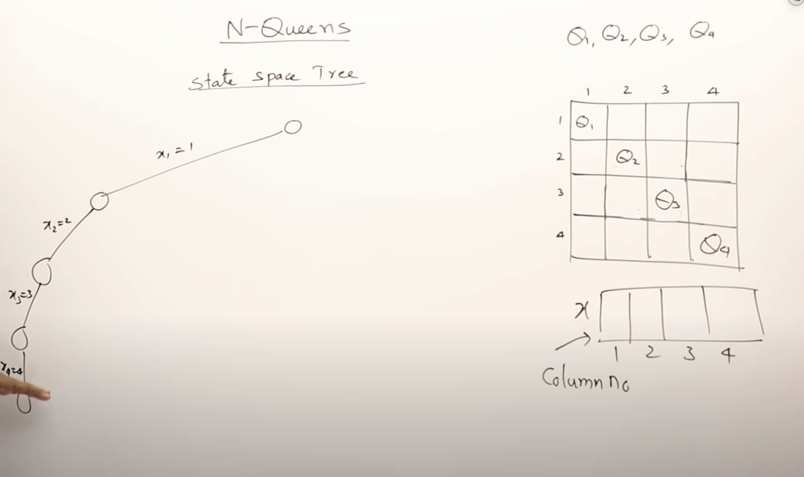
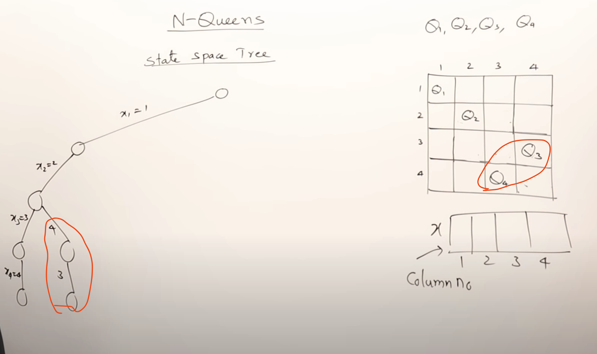
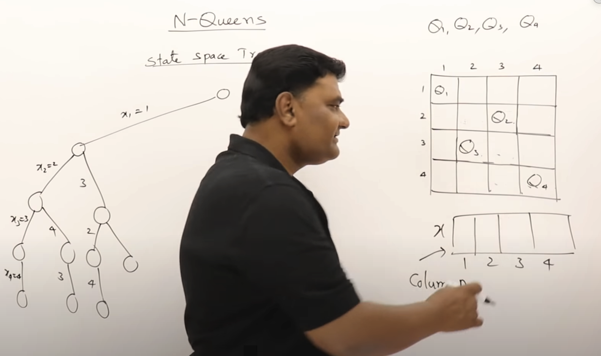
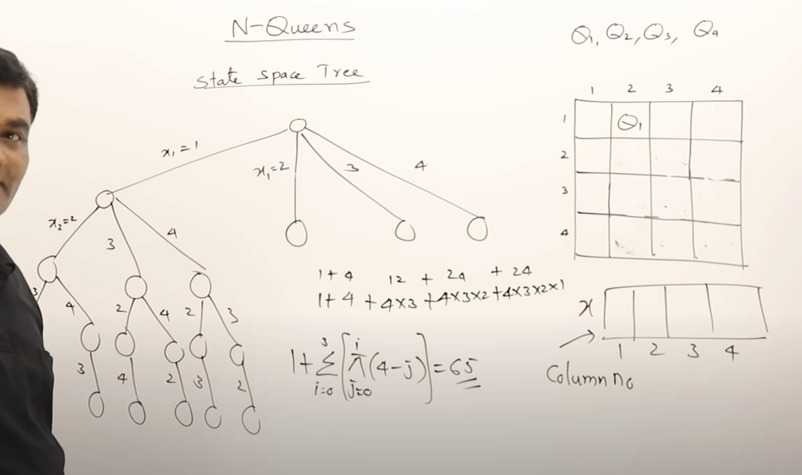
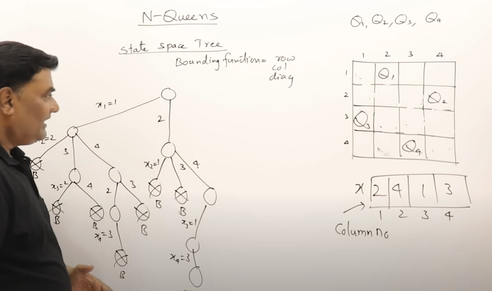

THe problem is based on place N number of queens in a NxN board such that no 2 queens are under attack.

Definition of attack:   
    When the queens are in same:    
        1. row
        2. column
        3. diagonal
   
We can have more than one solutions and we need all the possible solutions

For a 4 Qs in 4x4 board we have 16C4 methods -> Which is not very possible for the board

- Hence we place the Qs such that they are first Q in in first row, second Q in second row, ...

We will avoid keeping two Qs in the same column

We keep the solutions in a state space tree

1. First Possibility (Even though they will be under attack):
   

    Since it is wrong, we backtrack and try keeping the 3rd Q in 4th Column and 4th Q in 3rd Col

    

    

2. The complete state tree with all possibilities:

    

3. State tree with bounded function:

    
   